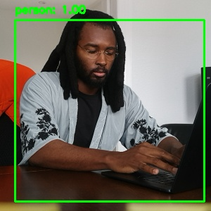
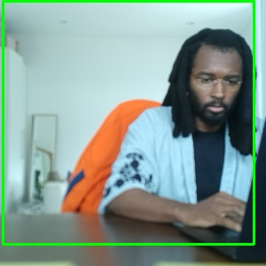

# 🐾 P1: Let There Be Sight

## Overview

This project demonstrates a vision-guided control system on the Mini Pupper robot, where the robot detects and centers a human in its field of view using real-time visual feedback. It is the first step in a larger embodied AI system designed to integrate biologically constrained perception with motor output.

The pipeline showcases a full perception–action loop:
- The robot **sees** (person detection),
- It **decides** (computes orientation error),
- And it **acts** (rotates to center the target).

---

## 🎯 Objectives

- Validate successful **leg and gait calibration**
- Demonstrate working **visual servoing**
- Use lightweight real-time detection suitable for limited compute
- Establish baseline for future biologically-informed control loops

---

## 🧠 What Was Done

- **MobileNet-SSD** model (OpenVINO 2021.4, 6 SHAVEs) was used to detect "person" objects.
- A **proportional controller** was implemented to compute yaw velocity from visual error.
- The robot turns to minimize the error between the person’s bounding box center and the image center.
- **Images are downsampled to 300×300**, reducing computational cost and approximating the resolution (≈68×102) of the downstream biologically constrained encoder network.
- Saved example **snapshots** and a **full video demonstration** of this process.

---

## 📷 Snapshots

### Person Off-Center (before correction)

### Person Centered (after correction)

---

## 🎥 Demonstration Video

Watch the 59-second demonstration here:  
👉 [Demo Video on Google Drive](https://drive.google.com/file/d/1Q1A3k_zQQ4qIFxdiCpT8__rJ8HH7LvGa/view?usp=sharing)

---

## 🧬 Biological Inspiration

- Image downsampling to **300×300** aligns with the input scale used in a biologically constrained encoder model (≈68×102).
- Future work will build on this to integrate **neural data-trained visual encoders** into the control loop.

---

## ⚙️ Model Details

- **Model**: `mobilenet-ssd_openvino_2021.4_6shave.blob`
- **Task**: Detect common objects in images with high speed and moderate accuracy
- **Why MobileNet-SSD**: Optimized for **real-time inference** on constrained hardware (e.g., Raspberry Pi + OAK-D)

---

## ⚠️ Limitations

- **Low-resolution input** may miss fine details (300×300)
- Only detects the **largest person**, ignoring others
- **No depth awareness** in current version
- **Hardcoded control** (no learning or generalization)

---

## ✅ Outcome

This project demonstrates that the robot can:
- Reliably detect a human object
- Adjust its movement to track the human
- Respond to visual stimuli in real time

This forms a **robust baseline** for future exploration of:
- Feature attribution
- Visual neural encoding
- Context-aware robotic planning

---

> _“The robot can see. It can move. And it can respond to what it sees.”_
