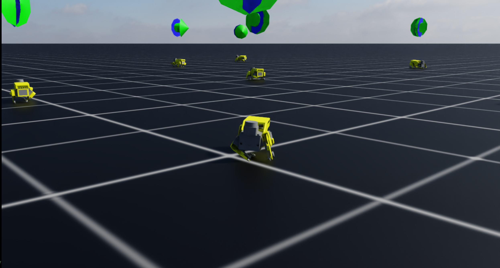

# SpotDMouse P2 Terrain Challenge - Isaac Sim: Successes & Limitations

Welcome to the **P2 Challenge**, part of the SpotDMouse project, where we apply reinforcement learning (RL) to teach our miniature quadruped robot to walk in simulation. This document outlines our experiences using **Isaac Sim**, highlighting both its strengths and critical limitations for small-scale robots like SpotDMouse.

---

## Successes with Isaac Sim

* Isaac Sim provides a **powerful and modern simulation environment**, with built-in support for quadruped locomotion tasks.
* Full-size quadrupeds (e.g., Unitree A1, Go1, Anymal C) are simulated effectively on flat terrain using RL.
* The standard **CAD to URDF to USD pipeline** works well for larger robots, enabling a clean workflow from design to deployment.
* High-performance physics, ROS2 integration, and visualization tools accelerate RL development.
* Gives the ability to train thousand of robots on modest cpompute poiwer by CS research standards
---

## Limitations for Miniature Quadrupeds (e.g., SpotDMouse)

While Isaac Sim is excellent for full-size quadrupeds, it currently struggles with miniature robots like SpotDMouse due to several technical limitations:

### 1. Small Parts Merging in the USD Pipeline

* During the CAD to URDF to USD conversion process, small components (e.g., feet) often lack defined mass, inertia, or collision properties.
* Isaac Sim merges these small parts into larger parent links, leading to **incorrect contact dynamics**.
* The entire leg may be treated as a contact surface rather than just the foot, resulting in exaggerated friction and unrealistic stability.

---

### 2. Physics Engine Instability for Miniature Robots

* Isaac Sim's default physics parameters (e.g., time step, solver iterations) are tuned for larger, heavier robots.
* For lightweight, small-scale robots:

  * Physics can become unstable.
  * Contact detection is unreliable.
  * The robot may bounce, slide, or collapse unexpectedly.
* To mitigate this, much smaller physics time steps (e.g., 1/800s) and parameter tuning are required.

---

### 3. Controller Tuning Challenges

* The default quadruped controller is designed for full-size robots.
* On miniatures:

  * Action space scaling must be reduced.
  * Joint torques need tighter control.
* Without these modifications, the robot jitters, flops, or fails to walk.

## Demo Video

[SpotDMouse Terrain Challenge Demo](https://drive.google.com/file/d/1zm9YpwRjZnWdH_Vl9Ln2R5OwYzORuqIE/view?usp=sharing)

---

### 4. GPU Simulation Crashes with Small Articulations

* PhysX GPU acceleration frequently crashes when handling tiny links with low mass.
* Common errors include illegal memory access and CUDA synchronization failures.
* For small robots, CPU-only physics is often required, sacrificing speed.

[***Suggested Image:*** Screenshot of an Isaac Sim error log showing GPU failure during small articulation simulation.]

---

## Why Miniature Robots Strain Isaac Sim

| Challenge                      | Explanation                                           |
| ------------------------------ | ----------------------------------------------------- |
| Physics time step              | Miniature robots need much finer simulation steps.    |
| Contact surface miscalculation | Small parts merged, inflating contact areas.          |
| Sensor instability             | Raycasting and IMU data unreliable at small scales.   |
| Controller sensitivity         | Requires extreme tuning of action space and torques.  |
| GPU simulation instability     | PhysX GPU acceleration fails with tiny articulations. |

---

## Lessons Learned

* Isaac Sim is well-suited for **macro-scale quadruped training**.
* For miniature robots like SpotDMouse:

  * Extensive physics and controller tuning is mandatory.
  * Careful contact surface definition is essential.
  * CPU-based physics may be necessary.
* Expect ongoing technical workarounds until Isaac Sim offers better support for small-scale robots.
---

## Later Add

1. **CAD ➡️ URDF ➡️ USD Pipeline Diagram** highlighting where small parts get merged.
2. **Contact Surface Comparison** between large and small robots.
3. **Training Progression Graph**, showing reward over time with snapshots of robot behavior.
4. **Isaac Sim Version Timeline**, indicating stability issues.
5. **Torque Application Plot**, demonstrating scale mismatches.
6. **Error Log Screenshot** of a typical small-robot GPU simulation crash.

Contributions to improve miniature robot simulation in Isaac Sim are welcome!
